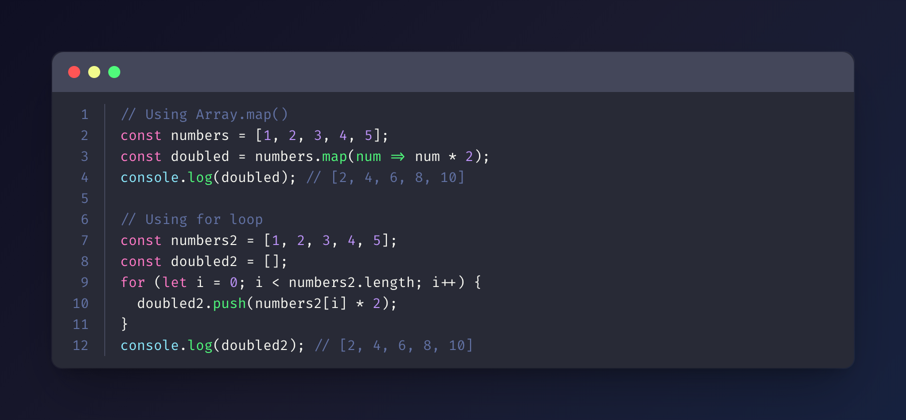
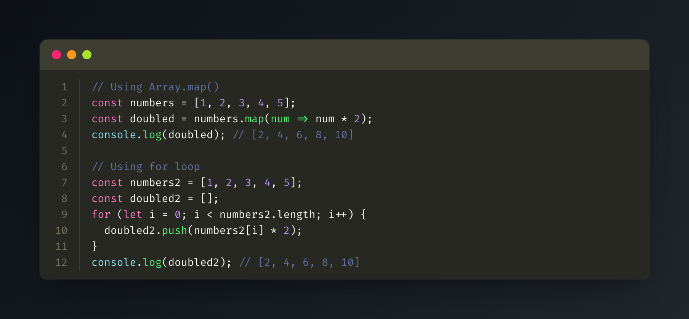
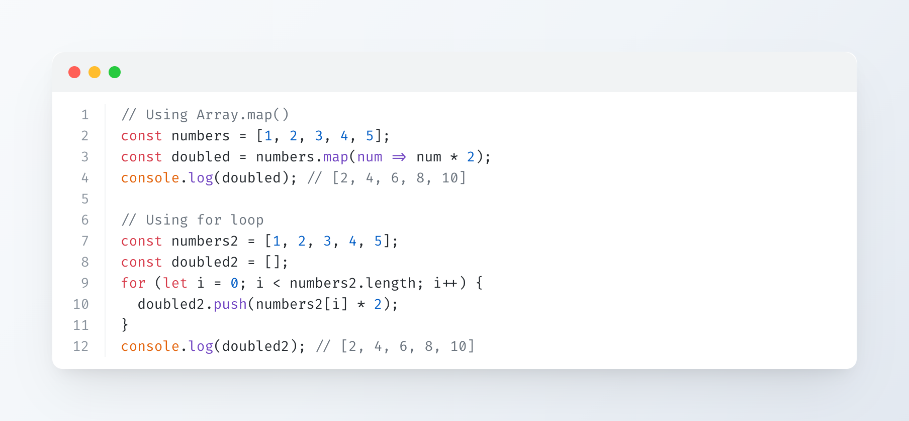
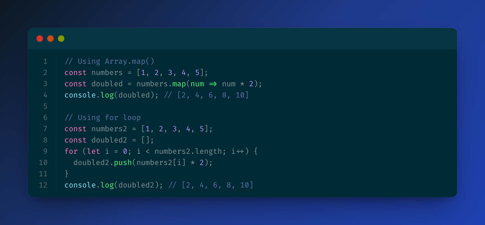
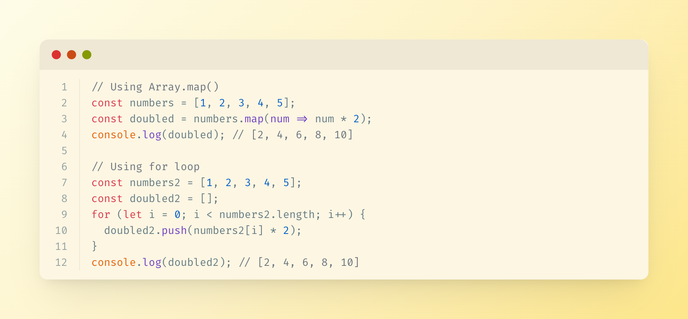

# Code snippet image MCP server

An MCP (Model Context Protocol) server that generates beautiful code snippet images to post to social media.

## Demo

_Watch the MCP server generate beautiful code snippet images in real-time_

## Features

- **Beautiful Code Images**: Generate beautiful code snippet images with syntax highlighting
- **Multiple Themes**: Support for Dracula, Monokai, GitHub, Solarized Dark/Light themes
- **Syntax Highlighting**: Support for multiple programming languages
- **Customizable**: Configurable dimensions, themes, and styling options

## Installation

```bash
npm install
npm run build
```

## Configuration

Add to your MCP configuration file:

```json
{
  "mcpServers": {
    "code-snippet-image-mcp-server": {
      "command": "npx",
      "args": [
        "-y",
        "code-snippet-image-mcp-server",
        "/custom/output/directory"
      ]
    }
  }
}
```

The server accepts an optional output directory as the first command line argument. If not provided, it defaults to `./output` in the current working directory.

## Usage

The MCP server provides one main tool:

### create_code_image

Generate a beautiful code snippet image:

**Parameters:**

- `code` (string, required): The code to convert to image
- `language` (string, optional): Programming language for syntax highlighting (default: "javascript")
- `theme` (string, optional): Color theme (default: "dracula")
- `title` (string, optional): Title for the code snippet
- `width` (number, optional): Image width in pixels (default: 800)
- `height` (number, optional): Image height in pixels (auto if not specified)
- `padding` (number, optional): Padding around the code window in pixels (default: 52)
- `backgroundColor` (string, optional): Custom background color (overrides theme background)
- `showLineNumbers` (boolean, optional): Show or hide line numbers (default: true)

**Example:**

```json
{
  "code": "const hello = () => console.log('Hello, World!');",
  "language": "javascript",
  "theme": "dracula",
  "title": "Hello World Function",
  "width": 800,
  "height": 600,
  "padding": 52,
  "showLineNumbers": true
}
```

## Supported Themes

### Dracula (Default)



### Monokai



### GitHub



### Solarized Dark



### Solarized Light



## Supported Languages

The server uses highlight.js for syntax highlighting and supports all languages that highlight.js supports, including:

- JavaScript/TypeScript
- Python
- Java
- C/C++
- Go
- Rust
- PHP
- Ruby
- And many more...

## Output

Generated images are saved in the specified output directory (or `./output` by default) with timestamps.

## License

MIT
